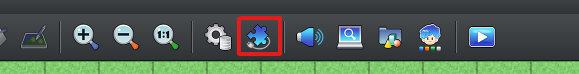
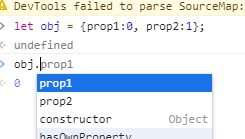

**Plugin Tutorial for RPG Maker MZ**

**1.0 Introduction**

1\.1 Who is this tutorial for?

**2.0 Guide to Using Plugins**

2\.1 What is a Plugin?

2\.2 Installing a Plugin

**3.0 Super Quick JavaScript Tutorial**

3\.1 Introduction

3\.2 Start off by running a script!

3\.3 Variables

3\.4 Control Structures: Conditional Branches

3\.5 Control Structures: Loops

3\.6 Functions

3\.7 Using Core Script Functions

3\.8 MDN Web Docs

**4.0 Making a Plugin**

4\.1 Preparations Conducted Before Making a Plugin

4\.2 Deciphering an Official Plugin

4\.3 Explanation about Annotations

4\.4 Points to Consider When Making an Asset Public

# **1.0 Introduction**
## **1.1 Who is this tutorial for?**
`　`The aim of this tutorial is to assist users in utilizing and developing scripts and plugins. These elements are essential for achieving advanced and efficient game development using RPG Maker MZ (abbreviated hereafter as "MZ").

`　`It is intended for users with a grasp and understanding of both the general flow of game production and the basic functions of either MZ or a previous PC version of RPG Maker. This tutorial will only provide a minimal level of explanation concerning JavaScript knowledge and syntax.
# **2.0 Guide to Using Plugins**
## **2.1 What is a Plugin?**
`　`When using MZ, the term "plugin" refers to an additional program file that allows you to change a game's specifications and operations from the most basic level. It uses a JavaScript text file (abbreviated hereafter as "JS file"). 

MZ is composed of a number of JS files collectively called core scripts. By supplementing and changing the contents of these core scripts using plugins, you can change MZ's game specifications in all kinds of ways, such as moving window positions or even adding entirely new menu options.
## **2.2 Installing a Plugin**
### **What to prepare:**
- An IDE (for example, Visual Studio Code, Atom, Notepad++, etc.)
- Web browser (Google Chrome or other browser used for viewing the internet)
### **Downloading a Plugin**
`　`Plugins range from files provided officially to those provided and sold by individuals. First, begin by acquiring the JS file in question.

`　`When obtaining a JS file over the internet, download it according to the standard methods specific to your browser. Do not change the filename unless provided with specific instructions to do so.

`　`The specific distribution method will depend on the creator. These various methods include placement on a service such as Dropbox, compression, or distribution through GitHub or as an individual JS file or sample project.

`　`Try opening the file you downloaded using a text editor. If the text appears in a garbled state, the file may not have downloaded properly.

### **Checking the License (Terms of Use)**　
`　`Before you start to use a plugin, check the license and terms of use. In many cases, this information is written on the distributor's website, within the JS file or an accompanying ReadMe file. Most licenses clarify the actions that are either permitted or forbidden.
### **Viewing the Plugin Manager Screen**
`　`First, place the JS file under the project's [js/plugins/] folder. Next, from MZ's editor, open the Plugin Manager (F10). You can also press the button indicated below.

`　`This will bring up a list of the plugins you have already installed for your project. As a new feature of MZ, we have introduced a checkbox on the left of the list. Now you can simply switch plugins ON/OFF. You can change the state of multiple plugins by shift-clicking a range of them and pressing SPACE.

`　`Warning messages will also now appear on the bottom of the screen. These are messages that are displayed when there is a strong possibility that a plugin will not function properly if you begin the game in that state.
### **Types of Warnings**
`　`Warning messages are of the following types, each of which requires the appropriate response:

- The plugin "AAA" may not support RPG Maker MZ.

  This message will appear if, for example, you try to use a plugin created for the previous version, RPG Maker MV.

- The plugin “AAA” requires the base plugin “BBB”.

  This message will appear if you have not added the prerequisite base plugin.

To resolve this error, refer to Help or other appropriate instructions and install the base plugin.

- The plugin “AAA” must be ordered before plugin "BBB."
- The plugin "AAA" must be ordered after plugin "BBB."

  For reasons such as preventing conflicts, the order in which plugins must be added may be specified.

To resolve this error, change the order as directed by the message.

- The plugin “AAA” has been registered as a duplicate.

  This message will appear if you have added and switched ON two or more of the same plugin on the Manager Screen.

There is no benefit to adding a plugin multiple times. To resolve this error, delete any extra plugins.

- The plugin “AAA” cannot be loaded.

  This message will appear if, for example, you deleted the actual file after adding the plugin from the Manager Screen. A load error will occur if you run the game in this state. To resolve this error, delete the plugin from the list or restore the file.
# **3.0 Super Quick JavaScript Tutorial**
## **3.1 Introduction**
`　`Scripts in MZ are a means of accessing the fundamental parts of a game's operations and specifications. As all game-related areas in MZ are implemented using the language known as JavaScript, scripts are also specified according to the syntax used by JavaScript.

`　`By mastering scripting, you can carry out game development at a much more advanced and efficient level than just constructing events through event commands.
### **Aim of This Chapter**
`　`This section is intended for anyone without experience using JavaScript. It provides an explanation that especially pertains to MZ and that concerns the minimal level of JavaScript knowledge and syntax required. Its ultimate aim is to help you master using the Script event command.

`　`So that you may reach this goal through minimal effort, we have omitted overly detailed explanations and refrained from rigorous descriptions in some areas. Please be sure to keep that in mind.

`　`Regardless of your level of experience with programming languages, we recommend that you have a grasp of MZ's basic specifications and methods for constructing events.
### **About JavaScript**
`　`JavaScript is a programming language that was originally intended for web browsers. Due to the introduction of Node.js, it has been applied to a wide range of uses in recent years, such as server-side processing.

`　`Although, as a result of this, it is now used in an abundance of informational publications and websites, the runtime environment and syntax will differ based on the application in use. If you copy code found at another location, such as a website, and attempt to run it using MZ, it will not work in some cases.

`　`Please be aware that, if you look at the JavaScript source on general websites with the aim of mastering scripts using MZ, you may be taking a fairly circuitous route.
### **Tip: Java and JavaScript are unrelated.**
`　`Although Java is primarily a programming language that is widely used for server-side processing, it has no relation to JavaScript.

`　`As it shares a similar name, be careful not to make a mistake when purchasing a book or searching the internet.
## **3.2 Start off by running a script!**
`　`Generally speaking, in order to practically learn a programming language, you first need to build a runtime environment on which to execute code. Such an environment has already been prepared for you when you use MZ. After creating a project on MZ, try a quick test play.

`　`After the title screen appears, press F8. This should open a window that is separate from the game, which provides developer tools that will be especially helpful when developing or debugging a game using plugins.
### **Log Output**
`　`Developer tools provide a large number of functions. For now, start by selecting the Console tab. It should appear as shown below.

`　`You can enter text on the white screen. First, try inputting the following statement.

console.log('Hello RPG Maker MZ');

`　`This should produce the result shown above. Just like that, you have run JavaScript and verified the results!

`　`The script you executed is a command that tells the console to display the string *Hello RPG Maker MZ*.

`　`As its name suggests, console.log is a command that logs a message to the output console, which allows you to check values and states at runtime.

`　`Perhaps there are users who will think, instead of using this type of tool, that they would rather run various scripts using the Script event command. However, we cannot recommend that method due to the following reasons:

- You cannot verify the runtime results using that window.
- There is no input completion function (in the console, text suggestions appear automatically after you partially enter a string).
- If the syntax is incorrect, an error will occur and the game will stop working.

`　`So, first, learn basic JavaScript syntax while outputting logs using developer tools, before aiming to use scripts in event commands.
### **Comments**
`　`The event command Comment makes it easy to write remarks about complex processing using an event command. There is also a function that corresponds to Comment in JavaScript.

`　`This function is itself called a "comment." If you write *//*, the subsequent string will become a comment; it will then be ignored when you run the program.

`	`// This text will be ignored when the program runs.

`	`console.log('This text will be outputted.');

`　 `If you wish to define a comment spanning multiple lines, you can use a block comment as shown below.

`	`/\*

`	 `\* If you wish to define a comment spanning multiple lines,

`	 `\* you can use a block comment.

`	 `\*/

`	`console.log('This text will be outputted.');

`　`By making skillful use of comments, you can create a program that is easy to understand.
## **3.3 Variables**
`　`In MZ, there is a concept called a variable. From the event command Control Variables, it is possible to specify a name and freely assign or change a value. The same type of system is also found in JavaScript.

`　`In this chapter, this tutorial will explain the differences between variables in JavaScript and MZ and their varying methods of use.
### **Declaring a Variable**
`　`First, as opposed to variables in MZ, you must declare a variable when using JavaScript.

`　`When declaring a variable, you convey to the program that you are defining a variable under a specified name. You cannot use a variable if it is not declared.

let aaa = 0;

`　`In the above example, we are declaring that we will use a variable with the name of *aaa* and, at the same time, we are assigning it a value of *0*. Although a value of *0* is assigned automatically to an event command variable, unless an initial value is assigned to a JavaScript variable, it will have no value at all. More precisely, the special value *undefined* is assigned signifying that the variable has no defined value.

`　`*let* is a syntax-defined word that is required for making a declaration. In addition to *let*, there are a number of words and terms that are syntactically defined by JavaScript. These are collectively known as reserved words.

`　`For the variable name *aaa*, you can enter a name of your choosing. However, you cannot use certain text including reserved words, which this tutorial just introduced, and some symbols.

Uncaught SyntaxError: Identifier 'aaa' has already been declared
### **Tip: Semicolons at the End of Lines**
`　`If you take a good look at the scripts appearing so far, you will see that a semicolon (;) has been placed at the very end. Although this is a symbol used to explicitly express the end of the statement, the script will function normally even without the semicolon. Whether or not you use semicolons is entirely your own decision; either choice is perfectly fine. However, it is important to be consistent. It may cause confusion if you add them in some places but not others.
### **Tip: Methods for Declaring Variables Other Than *let***
`　`If you used scripts with the previous version, RPG Maker MV (abbreviated hereafter as "MV"), you will probably recall the reserved word *var*. Using the same method as with *let*, you can also declare valuables with *var*. Although declarations using *var* are also valid in MZ, it is actually a fairly old word. While using it will not result in any errors or harm to your program, when you reach the stage of creating your own plugins, differences will become evident in precise areas such as disparities in the scope (valid range) of variables.

`　`Use *let* unless you have a particular reason or point of focus that requires otherwise.

`　`There is also another reserved word for declarations, *const*. Perhaps you are concerned that, just for declaring variables, there are too many different types. It would be difficult to explain about *const* at this point, so we will save that for later. For now, just be sure to learn about *let*.
### **Calculating Values**
`　`From the event command Control Variables, in addition to assigning values, it is possible to conduct basic calculations such as addition and multiplication. Naturally, you can do the same for variables within JavaScript.

`　`First, define a variable.

let x = 1;

`　`Next, write the respective calculation in the manner shown below.

|Type|Script|Result|Shortened Script|
| - | - | - | - |
|Addition|x = x + 1;|2|x += 1;|
|Subtraction|x = x - 1;|0|x -= 1;|
|Multiplication|x = x \* 2;|2|x \*= 2;|
|Division|x = x / 2;|0\.5|x /= 2;|
|Modulo|x = x % 2;|1|x %= 2;|

`　`Then the variable *x* will store the result of the calculation. Enter *console.log(x);* in the console to check the value it contains. To execute the calculation, you can use either the script or the shortened script. So you can see that it is possible to control variables in the same way as when using the event command.

`　`Additionally, when adding or subtracting a value of *1*, you can shorten the statement in the following ways:

x++;

x--;

`　`These are called the increment operator and decrement operator, statements frequently used in programming.
### **Tip: Two Points of Caution when Using Division**
`　`When carrying out division using the event command, the remainder would be dropped if the number was not divisible. However, JavaScript will not automatically round off or drop a remainder.

`　`Also, when dividing by zero, the special value *Infinity* or *-Infinity* will be returned, respectively, depending on whether the number being divided has a positive or negative value. This behavior can also be reproduced, in fact, when using the event command.
### **Types of Variables**
`　`When entering variables using the event command, you can only use a numerical value, unless using the Script operand which allows you to use strings. With JavaScript, you can also store other values in variables besides numbers. The following is a list of the most typical kinds of values:

- boolean value (true/false)
- string
- null
- undefined
- array
- object
- function

`　`A boolean value functions in the same manner as a switch when using an event command. When a variable is switched ON or OFF, that is expressed as either *true* or *false*, respectively.

let aaa = true;

`　`A string is an arrangement of characters such as symbols, English letters, and Japanese letters. The beginning and end of a string are enclosed by either single quotes (',') or double quotes (",").

let aaa = 'test mzあああ!"#$%';

`　`*null* expresses an empty state. It represents a different concept than the aforementioned *undefined*. It could be said that *undefined* expresses a state in which no value has been defined, while *null* expresses a state in which a value of nothing has been defined.

let aaa = null;

`　`Array, object, and function variables are fairly complex, so they will be explained in later sections.
### **Arrays**
`　`Among the types of variables explained in the previous section, arrays and objects are somewhat complex. Using these variables, you can work with multiple values in an organized way.

`　`An array is a variable that manages a group of values as a single entity.

let aaa = [1, 2, 3, 4];

`　`To reference its contents, write a statement such as the following:

console.log(aaa[0]);

`　`The value *0* specified within the square brackets is called an index. It indicates which part of the array will be referenced. The values in the array itself, such as *1* and *2,* are called elements.

`　`The index for the leftmost element is the number 0, and increases in order to 1, to 2 and so on. In other words, when running the above script, the element at index *0* (*1)* will appear.

`　`Arrays also possess a property called length. By referencing this property, you can acquire the number of elements in an array.

console.log(aaa.length);

Running this code will give us the value *4*.
### **Objects**
`　`So, when using an array, you could use numerical values as indexes and unify multiple values in one entity. To use strings as indexes, use an object instead. An object is similar to an associative array or structure in other languages. (Strictly speaking, to provide a slightly different explanation, there are formal associative arrays used separately in JavaScript. However, that has not been included in this section.)

let aaa = {bbb: 1, ccc: 2, ddd: 3};

`　`With an array, you can reference values using an index. For an object, strings such as *bbb* and *ccc* are generally called *properties*.

`　`In a similar manner to an array, to reference an object’s contents, write a statement such as the following. When inputting a string, remember to enter single or double quotes at the beginning and end:

console.log(aaa['bbb']);

`　`Running the above statement this will return *1*. When using an object, you can also reference properties in the following way:

console.log(aaa.bbb);

`　`With this method, you do not need to include brackets or quotes, though you cannot use symbols in the property name (with a few exceptions such as underscore).

`　`Referencing variables through properties using a period like this is a method frequently employed by the core scripts. Make sure you have a strong grasp of these basic points.

`　`In terms of the meaning of *aaa.bbb*, it references the property *bbb* from the object *aaa*.
### **Practical Application**
`　`In this section, a tutorial will show you how to run complex programs using the knowledge learned up to this point. Please make sure that you have gained a proper understanding of the material before you begin.

`　`Try to run the following script, but instead of just copying it, be sure to enter it directly yourself.

let obj = {prop1:0, prop2:1};

obj.prop1 += obj.prop2;

let propName = 'prop3';

obj[propName] = 5;

let num = obj.prop3;

console.log(obj.prop1 + obj.prop2 / num);

To explain what is happening in each line.

1. By declaring the variable *obj*, you will store a newly created object.
1. To *obj*'s property *prop1*, you will add the value of *prop2*. The value *0 + 1*, or in other words *1*, is stored within *prop1*.
1. You will declare the variable *propName* and store the string *prop3*.
1. You will create a new property for the variable *obj*. The property's name becomes the value of the variable *propName*, or in other words *prop3*.
1. To the variable *num*, you will assign *obj.prop3*, which was defined in the previous step. *5* is stored in *num* as a result.
1. Finally, you will output the results of the calculation *prop1 + prop2 / num*. In the same manner as actual mathematics, you can combine multiple mathematical operations.

`　`The first point deserving special notice is step #4. This is where you assign a variable to the property. In JavaScript, you can reference a property name using the value of a variable. 

`　`Next, we will discuss step #6. When using the event command, only a single calculation could be executed per command. On the other hand, with JavaScript, you can conduct multiple calculations in a single operation in the same way as actual mathematics. When it comes to mathematics, you probably know that mathematical calculations are assigned an order of operations. For example, when conducting addition and multiplication, multiplication is calculated first.

`　`As a result, the calculation *1 + 1 / 5* will output *1.2*.

### **Tip: Input Completion**

`　`When you manually enter the above script, upon entering *obj* in the second line, a list like the one shown below should pop up.

`　`Known as input completion (or widely recognised as Intellisense to users of development environments like Visual Studio), through this function, the developer tools predict the text you might enter and provide suggestions. Using this functionality you can reduce input and syntax errors, so be sure to take advantage of it.

## **3.4 Control Structures: Conditional Branches**
`　`When constructing a complex event using MZ, the Conditional Branch command becomes absolutely essential. JavaScript also provides a method of notation that is equivalent to Conditional Branch: the *if* statement.
### **Conditional Branches Using *if***
`　`An *if* statement is the most basic structure that allows for some type of procedure to execute only when a condition is satisfied. The code enclosed by curly braces will only execute if the condition specified in the parentheses is satisfied:

- Structure

  if (conditional expression) {

`  `This procedure will execute if the condition is met.

}

- Example

  let aaa = 1;

if (aaa <= 1) {

`  `console.log('ok1');

`  `console.log('ok2');

}

`　`A conditional expression is written within the parentheses. This expression needs to contain either a comparison operator or boolean value. (Be sure to review the variable types if you have forgotten them.) The following types of comparison operator may be used:

|Comparison Operator|Meaning|
| - | - |
|a === b|*a* and *b* are identical|
|a !== b|*a* and *b* are not identical|
|a >= b|*a* is greater than or equal to *b*|
|a <= b|*a* is less than or equal to *b*|
|a > b|*a* is greater than *b*|
|a < b|*a* is less than *b*|

`　`The area encompassed by curly braces is known as a block. A block is a set of statements that will be run in the same scope. In addition to *if* statements, blocks will be used from here onwards, so be sure to learn this concept fully.

`　`Within the event command Conditional Branch, you will find the checkbox Create Else Branch. This can be reproduced within an *if* statement.

let aaa = 1;

if (aaa <= 1) {

`  `console.log('ok1');

`  `console.log('ok2');

} else {

`  `console.log('ng1');

}

`　`Following the block for the *if* statement, you can enter *else* and create another block. The latter block will be executed if the condition is not met.
### **Tip: Block Indentation**
`　`When writing a block, insert a predetermined number of spaces or tabs as shown below. This is known as an indent. Some development environments will do this for you.

if (aaa <= 1) {

`  `console.log(‘This line will be indented.');

}

`　`Using indents will make it easier for humans to read the flow of the program. An indent is typically composed of a single tab, two double-byte spaces, or four single-byte spaces.

`　`When creating events in RPG Maker, indents are also used for structures such as conditional branches and loops; if you’re already familiar with that structure it should be easy to apply that knowledge to these concepts.
### **Tip: Inexact Equality Operator**
`　`In other programming languages, *a == b* is frequently used as the equality operator; this operator can in fact also be found in JavaScript. However, it can be problematic because if the types of the operands differ, the statement will still return *true* even if different things are being compared (like the number *1* and the string *'1'*).

`　`For this reason, during MZ development, only *===* (which is called the exact equality operator) is used in most cases. Don’t worry about remembering == as you’ll likely never need it.
### **Logical Operators**
`　`We will now explain about more complex kinds of *if* statements. When using the event command, for procedures that could only be branched to if both *A* and *B* were satisfied, you may have placed nested conditional branches. You may also have written two conditional branches for procedures that could be branched to if either *A* or *B* were satisfied.

`　`With JavaScript, you can combine these branches in one statement. *A and B* is expressed as *A && B*, and *A or B* is expressed as *A || B*.

let a = true;

let b = false;

if (a && b) {

`  `console.log('The conditions are not satisfied because, although a is true, b is false.');

}

if (a || b) {

`  `console.log('The conditions are satisfied because, although b is false, a is true.');

}

`　`Another type of logical operator, *!*, expresses negation (often referred to as “not”). This returns a result that inverts a boolean value.

let a = true;

if (!a) {

`  `console.log('The condition is not satisfied because a is true and the result inverts that value.');

}　
### **Tip: What about specifying variables other than booleans within conditions?**
`　`If you specify variables other than booleans or comparison operators within the conditional expression of an *if* statement, this will return the following types of results. Although this would be useful when checking for *null* within an array or object, it is not recommended when judging numbers or strings.

|Type|Example if false|Example if true|
| - | - | - |
|number|0, NaN|variables other than that shown on the left (including negative values)|
|string|empty string ('')|variables other than that shown on the left (including the string *'0'*)|
|array, object|n/a|all variables (including empty arrays and empty objects)|
|null, undefined|all|n/a|

### **Conditional Branches Using Conditional Operators**
`　`Conditional operators (also known as ternary operators) are, simply put, a type of notation used to write branch processing within one line. They are also used frequently within MZ's core scripts.

- Structure

  conditional expression ? expression if the condition is satisfied : expression if the condition is not satisfied;

- Example

  let aaa = 1;

let bbb = (aaa === 1 ? 2 : 3);

console.log(bbb);

`　`In the above example, the value assigned to *aaa* is *1*, so *2* will be assigned to *bbb*.

`　`You can also substitute conditional operators for the *if* statements used above. The benefit of a conditional operator is that it allows you to express a conditional expression within one overall expression.

`　`With MZ, you can also use scripts for mathematical formulas for skills and items. However, the entry field has only one row.

`　`In the following example, to the damage formula for a normal attack, a judgment based on a conditional operator has been added. Although it is probably an unfamiliar notation, the conditional expression *b.isStateAffected(5)* signifies the condition that the attack target is in the state represented by State ID[5].

a.atk \* 4 - b.def \* 2 + (b.isStateAffected(5) ? 100 : 0);
## **3.5 Control Structures: Loops**
`　`The procedures conducted by the event commands Loop and Break Loop are also provided in JavaScript. The conditional branches discussed in the previous section and the loops in this section are implemented within almost all programming languages and not only JavaScript.

`　`As you may have noticed already, the event commands used within RPG Maker were originally created while referring to the variables, conditional branches, and other control structures that are found within programming languages.
### **Loops Using *while***
`　`The most basic loop procedure is a *while* statement. Using the event command, if you create a conditional branch within a loop in order to stop it, you will be unable to specify a closing condition for the loop. You can, however, designate a closing condition by using a *while* statement in JavaScript.

- Structure

  while (conditional expression) {

`  `This procedure will run repeatedly.

}

- Example

  let a = 0;

while(a < 10) {

`  `a++;

`  `console.log(a);

}

`　`In the above example, as long as *a < 10* is satisfied, the operations contained in the block will be executed repeatedly. This will provide a log output of numbers spanning from *1* to *10*.
### **Tip: Fear of an Endless Loop**
`　`What would happen if you specified a formula that returns *true* perpetually for the *while* statement's conditional expression? The answer is the loop's operations would continue to execute endlessly until the game freezes. The same result would also occur if using the event command Loop.

`　`In such a case, not only would it stop the game, it would also place a burden on your PC. Be sure to carefully discern whether or not there is a mistake present in the language specified for the conditional expression.
### **Loop Breaks**
`　`The procedure conducted by the event command Break Loop is also provided in JavaScript. It is known as a break.

let a = 0;

while(a < 10) {

`  `a++;

`  `console.log(a);

`  `if (a >= 5) {

`    `break;

`  `}

}

In this example, the loop was discontinued at the point it finished outputting numbers up to *5*.
### **Loops Using *for***
`　`A *while* statement is a structure that executes a procedure repeatedly on and on while a conditional expression is satisfied. A *for* statement, which this tutorial will now introduce, can be used when you have already decided how many times you want the loop to repeat from the beginning.

- Structure

  for (initialization; conditional expression; increment expression) {

`  `This procedure will run repeatedly.

}

- Example

  for (let i = 0; i < 5; i++) {

`  `console.log(i);

}

`　`In the above example, this will provide a log output of numbers spanning from *0* to *4*. *i* is typically known as a counter variable. As this is a standard type of variable, you can select any name you like. However, *i* is often used here.

`　`You can also use *for* statements when we want to execute the procedures for an array repeatedly.

let aaa = [1, 3, 5, 7, 9];

for (let i = 0; i < aaa.length; i++) {

`  `console.log(aaa[i]);

}

`　`In the above example, this will provide a log output of all elements in the array in the order of *1*, *3*, *5*, *7*, *9.*
### **Loops Using *for-in***
`　`In the last section, this tutorial introduced the concept of repeating an array's procedures. However, there is actually an easier way to notate that. If you wish to repeat the procedures for all elements in an array, use *for-in*.

- Structure

  for (declare variable for index in array) {

`  `This procedure will repeat.

}

let aaa = [1, 3, 5, 7, 9];

for (let i in aaa) {

`  `console.log(aaa[i]);

}

`　`Using *for-in*, the array's indexes, meaning numbers spanning from *0* to *4* in order, will be entered into the variable *i*. As a result, in the same manner as the example in the previous section, this will output all elements in the array, meaning *1*, *3*, *5*, *7*, *9.*

`　`*for-in* can also be used for objects other than arrays.

- Structure

  for (declare variable for property name in object) {

`  `This procedure will repeat.

}

- Example

  let aaa = {bbb:1, ccc:2};

for (let property in aaa ) {

`    `console.log(aaa[property]);

}

`　`In the above example, the property names *bbb* and *ccc* are entered into the variable *property*. As a result, *1* and *2* will be outputted in the log. It is determined randomly whether 1 or 2 will be outputted first. Be sure to be aware of that point.
### **Loops Using *for-of***
`　`In the same manner as with *for-in*, using *for-of*, we can easily enter the notation for a procedure that will repeat for an array. The one point of difference in comparison to *for-in* is that, instead of indexes, the actual elements are stored for the variable.

- Structure

  for (declare variable for element of array) {

`  `This procedure will repeat.

}

- Example

  let aaa = [1, 3, 5, 7, 9];

for (let data of aaa) {

`  `console.log(data);

}

`　`As *for-of* is the more convenient of the two, it is used frequently within core scripts. However, as opposed to *for-in*, *for-of* cannot be used for an object.
## **3.6 Functions**
`　`As you read and decipher core scripts and master the use of scripts, functions are the most important concept you will come across.

`　`In a programming language, a function is something that allows you to easily call for multiple procedures in a united fashion. If you define within a function the procedures you want to run many times, by merely calling that function, you can then execute those procedures.

For the time being, you can consider this as a similar concept to a Common Event.
### **Defining a Function**
`　`In order to execute a function, first, you must define the function that will be called.

- Structure

  function functionName() {

`    `procedure you wish to execute

}

- Example

  function aaa() {

`    `console.log(111);

}

`　`In the same way as with variable names, you can freely assign the function name. Likewise, you cannot use reserved words or symbols excluding a few exceptions.

`　`The fact is, if you make good use of scripts, you will not have many opportunities to define functions. That said, core scripts are actually an enormous collection of functions. At this point, the key thing to know about functions is that they are especially important to learning about scripts.
### **Calling a Function**
`　`The expression used to call a defined function is shown below.

- Structure

  function name();

- Example

  aaa();

`　`In this way, we add parentheses after the function name and then call it. The majority of procedures written in the event command Script call a function. For this reason, be sure to properly remember this notation method.
### **Arguments**
`　`When calling a function, you can pass parameters such as numbers and strings to the caller of that function. This method is known as an argument. This concept is not found in Common Event, so it may be a little confusing. For now, this tutorial will recall a function that is used in mathematics.

y = f(x)

`　`Functions used in mathematics follow the line of thinking that *x* is for input and *y* is for output. An argument is equivalent to the value *x* expressed in the above example.

First, please take a look at an example.

- Structure

  function function name (parameter(s)) {

`    `procedure you wish to execute

}

function name (argument(s));

- Example

  function outputSum(bbb, ccc) {

`    `console.log(bbb + ccc);

}

outputSum(10, 11);

`　`If you execute the example procedure, a log of *21* will be outputted. The steps involved in this procedure are as follows.

1. By calling the function *outputSum*, you pass the argument *10* and the argument *11*.
1. Processing shifts to the function *outputSum*, and the arguments *10* and *11* are stored in the parameter *bbb* and the parameter *ccc*, respectively.
1. The value of *ccc* added to *bbb* in the *console.log*, meaning *21*, will be outputted in the log.
### **Return Value**
`　`The return value is the result given when executing a function. Once again, recall that mathematical function.

y = f(x)

`　`The above value *y* is the return value. Please look at this example.

- Structure

  function function name() {

`    `return value you wish to return

}

let aaa = function name();

- Example

  function getHundred() {

`    `return 100;

}

let bbb = getHundred();

console.log(bbb)

`　`When executing the example function *getHundred*, the fixed value *100* will be returned as the return value, meaning *100* will be stored in the variable *bbb*.
### **Storing Functions in Variables**
`　`When this tutorial explained about types of variables, perhaps you remember that one type was called a function. In JavaScript, you can enter defined functions within a variable.

- Structure

  let function name = function() {

`   `procedure you wish to execute

}

function name();

- Example

  let aaa = function() {

`   `console.log(1);

}

aaa();

`　`When specifying an argument, use the following structure.

let aaa = function(bbb) {

`   `console.log(bbb);

}

aaa(1);

`　`As you are able to define a function within a variable, you are also able to define it within an object's property. This is an especially important point. A function that is defined as an object's property is specially referred to as being a "method." However, in this section, this tutorial will consistently use the term "function" throughout.

let aaa = {};

aaa.bbb = function() {

`   `console.log(1);

}

aaa.bbb();

`　`So, if you are able to store functions within variables, what benefits might that bring? In truth, when using the event command Script, you are given almost no opportunity to enter functions within variables. Nevertheless, if you correctly understand this concept, when calling functions defined in core scripts, you will be able to accurately understand why they are written in such a way.

`　`Having read this section, be sure to keep this concept in mind.
### **Tip: Arrow Functions**
`　`When storing functions within variables or specifying them for arguments, you can use a simplified notation method known as an arrow function.

let aaa = (bbb) => {

`   `console.log(bbb);

}

aaa(1);

`　`By using the *=>* symbol, you can define the function with a smaller number of characters. If there is only one parameter, you can also omit the parentheses.

`　`Also, if you are able to express the contents of a function within one expression, you can omit the block (braces) or the use of *return* to return a return value.

`　`Functions defined through arrow functions handle the execution agent *this* differently than normal functions. At this stage, it would be difficult to explain those differences, so this tutorial will not include that information.
## **3.7 Using Core Script Functions**
`　`MZ core scripts are a massive collection of functions. These functions are defined in the form of objects' properties.

`　`In this section, you will learn the methods for using core scripts' functions.
### **Acquiring Variables**
`　`The script used to acquire the contents of game variables is shown below. Thanks to the developer tool, when you input this text up to *$game*, *$gameVariables* will appear as a suggestion.

`	`$gameVariables.value(1);

`　`First, take a look at *$gameVariables*. As an object that handles game variables, it has been defined as a core script. Next, there is *value*. This is a function that is a property owned by *$gameVariables*. It has also been defined within the core scripts.

`　`The argument *1* is the variable number. In other words, when running the above script, this will return the value of variable number *1* as the return value.

`　`If there is any part of this explanation that you are unable to understand, be sure to read the section about functions one more time.
### **Tip: Global Variables**
`　`Variables that can be referred to anywhere within a program are known as global variables. A number of these have been defined within the core scripts. Including *$gameVariables*; almost all of the variables that begin with the symbol *$* are global variables.

`　`Within JavaScript, variables declared on the top level (area not within some kind of function block) are treated as global variables. (Variables that are used without being declared are also considered global variables. However, if you try to use global variables by utilizing this method, this may cause an error in an unrelated area. It is therefore an exceptionally risky method.)

`　`Placing a *$* at the beginning of the variable is a means of clarifying that it is a global variable.
### **Setting Variables**
`　`Next, the tutorial will explain scripts for setting the values within game variables.

`	`$gameVariables.setValue(1, 3);

`　`Same as *value*, *setValue* is also a function possessed by *$gameVariables*. This has two parameters. The first parameter contains a variable number and the second holds a set value.

`　`After you execute a script for setting a value, if you run a script for reacquiring the value, you should be able to confirm that the set value has been reflected.

### **Database Acquisition**
`　`MZ possesses enormous databases. All of the values entered here are stored in the global variable *$dataXXX*.

`　`As one example, try to run the following script.

`	`$dataActors[1].name;

`　`When you run the script, it should return the name of the first actor recorded in the database *Actors*. *$dataActors* is an array variable defined by a core script. It is an object with indexes that store a database ID and elements that store the value recorded for actors in the database. The element at index *0* is *null*, so be careful in that regard.

`　`*name* is one of the properties owned by the object corresponding to each respective *$dataActors* element. It stores the value entered for a name.

`　`Other databases are also defined based on the same essential ideas. A list of those databases appears below:

|Variable Name|Definition|
| - | - |
|$dataActors|actors|
|$dataClasses|classes|
|$dataSkills|skills|
|$dataItems|items|
|$dataWeapons|weapons|
|$dataArmors|armor|
|$dataEnemies|enemy characters|
|$dataTroops|enemy groups|
|$dataStates|states|
|$dataAnimations|animations|
|$dataTilesets|tilesets|
|$dataCommonEvents|common events|
|$dataSystem|system, language|
|$dataMapInfos|map tree data|
|$dataMap|map data|

`　`As it would not be possible to cite all of the properties of each database at this time, you will find a separate reference here. By consulting the reference, you can obtain all of the information included in the databases.

<https://forums.rpgmakerweb.com/index.php?threads/rpg-maker-mz-script-call-reference.122501/>
### **Controlling Game Objects**
`　`There are many variables handled during gameplay other than game variables. These include party members' HP, possessed items, and enemy characters' remaining HP. As opposed to databases, such values change based on the state of progress in-game. In this section, this tutorial will use the term "game objects." Game objects are stored in the variable *$gameXXX*.

`　`*$gameVariables*, in which game variables have been entered, is one version of this variable.

|Variable Name|Data Contained|
Contains Saved

Data (Y/N)
|
| - | - | - |
|$gameTemp|Data you want to store temporarily|N|
|$gameSystem|System settings data|Y|
|$gameScreen|Data pertaining to screen effects|Y|
|$gameTimer|Data pertaining to timers|Y|
|$gameMessage|Data pertaining to messages and options|N|
|$gameSwitches|Switch data|Y|
|$gameVariables|Variable data|Y|
|$gameSelfSwitches|Self switch data|Y|
|$gameActors|Data pertaining to all actors|Y|
|$gameParty|Data pertaining to parties|Y|
|$gameTroop|Data pertaining to enemy groups|N|
|$gameMap|Data pertaining to maps|Y|
|$gamePlayer|Data pertaining to players|Y|
|$testEvent|Data pertaining to event tests|N|
|DataManager|Set of functions handling the loading of databases|N|
|ConfigManager|Set of functions handling the setting of options|N|
|StorageManager|Set of functions handling file input/output|N|
|FontManager|Set of functions handling font files|N|
|ImageManager|Set of functions handling the loading of images|N|
|EffectManager|Set of functions handling particle effects|N|
|AudioManager|Set of functions handling the playing of background music and other audio|N|
|SoundManager|Set of functions handling the playing of system sound effects|N|
|TextManager|Set of functions handling language|N|
|ColorManager|Set of functions handling system colors|N|
|SceneManager|Set of functions handling scene controls|N|
|BattleManager|Set of functions handling all aspects of battles|N|
|PluginManager|Set of functions handling plugins|N|

`　`Within the following reference, you will find a compilation of the specific methods for obtaining data by means of each object.

<https://forums.rpgmakerweb.com/index.php?threads/rpg-maker-mz-script-call-reference.122501/>

`　`The game objects included in the above table can be broadly divided into two categories: objects known as *$gameXxx* and objects named *XxxManager*.

`　`*$gameXxx* retains functions and data in a combined fashion. For example, *$gameParty* holds data pertaining to the current party, and at the same time, provides a function that adds members to the party.

`  `On the other hand, as a general rule, *XxxManager* only provides a function. As demonstrated in the table, these objects are divided by use and organized so that, for example, images are loaded by *ImageManager* and sound is loaded by *AudioManager*.
### **Tip: Object Orientation**
`　`If you are someone with an interest in scripting, you probably have heard at least once about object orientation. Although it would be difficult to explain about object orientation in a concise manner, you can say that it is the handling of related functions and data in a combined fashion, as seen with *$gameXxx*. During object orientation, the function itself is known as a method.

`　`As the data is hidden as a general rule, it can only be handled externally by means of a method. The method will determine the manner in which the data will be handled.

`　`You do not necessarily need to know about this approach when dealing with scripts. However, the more you need to carry out programming design, there may come a time when you attempt to make a large plugin. That is when you should know about object orientation.
## **3.8 MDN Web Docs**
`　`Up to this point, this tutorial has explained the basic structures found in JavaScript in quick fashion. Naturally, the tutorial has not covered everything there is to know about JavaScript. 

If you wish to learn about the makeup and specifications of JavaScript, MDN (Mozilla Developer Network) Web Docs are recommended. It is a thorough collection of specifications and technical information pertaining to web development technology including JavaScript.　

`	`<https://developer.mozilla.org/ja/docs/Web/JavaScript>

`　`As these docs are not specifically intended for MZ, it goes without saying that all of this information will not be applicable. However, if you have come to a dead end while you are learning JavaScript, you can surely find the hint you need to solve your problem if you search therein.
## **JavaScript Built-in Functions**
`　`JavaScript provides a large number of functions that have been predefined to allow for the efficient handling of arrays and strings. Although this tutorial would be unable to present all of those functions herein, it will introduce a number of functions that are particularly useful when dealing with scripts.

`　`In terms of the other functions available, that information is compiled within the aforementioned MDN Web Docs.　
### **Arrays**
`　`Here, you will find explanations of functions that are frequently employed when dealing with arrays. To call an initialized variable, you can use *[]*.

`	`let aaa = [];

`	`aaa.push(1);

`　`A list of these functions appears on the page linked below.

<https://developer.mozilla.org/ja/docs/Web/JavaScript/Reference/Global_Objects/Array>

`　`Many arrays can be found within the data defined by core scripts. If you gain a mastery of the types of array functions and their methods of use, this will prove exceptionally helpful in writing efficient scripts.

- Addition and Extraction of Elements

`　`These are functions for adding or extracting elements at the end or beginning of an array.

|Function|Definition|
| - | - |
|push|Adds an element to the end of the array|
|pop|Extracts and returns an element from the end of the array|
|unshift|Adds an element to the beginning of the array|
|shift|Extracts and returns an element from the beginning of the array|

- Repetition for All Elements in an Array

`　`These are functions that can be used if you wish to execute the respective procedures for all elements within an array. A distinguishing feature of these functions is that they specify a function for an argument and pass the elements of an array to that function's argument. As it would be difficult to convey this concept with a verbal explanation, please look at this example.

`	`let aaa = [1, 2, 3];

`	`aaa.forEach(item => {

`	    `console.log(item); // 1, 2, 3 will be outputted in order

`            `});

`　`These functions can be used in place of the *for* statements explained earlier. If you utilize them properly in line with their intended use, you will be able to write easy-to-read scripts that have very few bugs. These functions are also used frequently within core scripts, so be sure to remember them.

`　`Additionally, these functions work well in tandem with arrow functions. Be sure to master them together with the method for writing arrow functions.

|Function|Definition|
| - | - |
|forEach|Executes the function passed to an argument for all elements within an array|
|map|Returns a new array containing elements comprised of the return values of a function passed to an argument|
|filter|Returns an array that only includes elements with a return value of *true* from a function passed to an argument|
|find|Returns the first element with a return value of *true* from a function passed to an argument|
|findIndex|Returns the first index with the return value of *true* from a function passed to an argument|
|some|Returns *true* if *true* is returned from even one of the return values from a function passed to an argument|
|every|Returns *true* if *true* is returned from all of the return values from a function passed to an argument|
|reduce|Consolidates the array into a single value, using a function passed to an argument|

`　`*reduce* is fairly complicated, so this tutorial will not include a full explanation in this section. An in-depth explanation is provided in MDN Web Docs.

- Other Functions

`　`JavaScript provides a large number of other functions that are useful when dealing with arrays.

|Function|Definition|
| - | - |
|concat|Returns a new array consolidating values or arrays specified in arguments|
|includes|Returns *true* if the value specified in an argument is contained within an array|
|join|Returns a string consolidating all elements in an array using the separator string specified in an argument; commas will be used if the separator string is omitted|
|splice|Allows you to delete or insert array elements by specifying an index; specify an index in the first argument, the number of values to delete in the second argument, and the elements to insert in the third argument and beyond|

### **Math**
`　`*Math* modules are a set of functions in which the functions and constants used in mathematics are defined. As opposed to the arrays described in the previous section, they are not used in relation to variables they have defined. They call a *Math* function that has been defined in a fixed manner, such as *Math.abs*.

`　`This is fairly similar to the core script *XxxManager*.

`	`let aaa = Math.abs(-100);

`　`A list of these functions appears on the page linked below.

<https://developer.mozilla.org/ja/docs/Web/JavaScript/Reference/Global_Objects/Math>

`　`From among these *Math* modules, this section will explain about the functions that are used by core scripts and for mathematical formulas dealing with areas such as skills.

|Function|Definition|
| - | - |
|Math.abs(n)|Returns the absolute value of the number *n*|
|Math.ceil(n)|Returns the smallest integer exceeding the number *n*; can be used for operations such as rounding up a decimal point, but not for designating a negative value for an argument|
|Math.floor(n)|Returns the greatest integer not exceeding the number *n*; similarly, can be used for operations such as rounding down a number, but not for designating a negative value for an argument|
|Math.round(n)|Returns an integer rounding off the number *n*|
|Math.trunc(n)|Returns the value of number *n* with the decimal point discarded; can be used to round down a number more expressly in comparison to *floor*; *floor* is used more often by core scripts|
|Math.max(n, m...)|Returns the greatest number among numbers specified in an argument; allows you to specify how many numbers you want in the argument|
|Math.pow(n, m)|Returns the value of number *n* to the power of *m*|
|Math.randomInt(n)|Returns a random integer within a range from *0* to *n-1*; this function was added, in fact, by core scripts and is not written about in MDN|

### **Strings**
`　`Here, this section will explain about functions that are frequently employed when dealing with strings. Just like arrays, strings are often used by core scripts. If you gain a grasp of the most convenient functions, this will prove helpful when writing scripts.

`	`let aaa = 'AAAA';

`	`let bbb = aaa.toLowerCase();

`　`A list of these functions appears on the page linked below.

<https://developer.mozilla.org/ja/docs/Web/JavaScript/Reference/Global_Objects/String/toLowerCase>

`　`A list of frequently used functions appears below.

|Function|Definition|
| - | - |
|includes|Returns *true* if the string specified in an argument is contained therein|
|toLowerCase|Returns a new string that is a lowercase letter version of the string|
|toUpperCase|Returns a new string that is an uppercase letter version of the string|
|substring|Returns a string that is a portion of the original string spanning from a starting position to an ending position specified in arguments|
|replace|Replaces the string specified in the first argument with the string specified in the second argument|
|split|Returns strings after splitting them into an array, using the character (or characters) specified in an argument as a separator string|

# **4.0 Making a Plugin**
`　`In this chapter, this tutorial will provide information that will help you get started in actually creating a plugin by making good use of the JavaScript knowledge you gained from the previous chapter.
## **4.1 Preparations Conducted Before Making a Plugin**
### **Editor Installation**
`　`Plugins are principally written in JavaScript. As a plugin file contains a text format, it is possible to develop it through a commonly used notepad application or text editor. However, it is recommended that you prepare a dedicated editor specially designed for JavaScript development.

`　`If you search for a dedicated editor, you will find many articles that provide comparisons. Choose whichever editor meets your preferences. It is a good idea to refer to newer articles in terms of when they were posted.

`　`A dedicated editor will possess the following kinds of features.

- Code completion (after you write code partially, predicts and suggests the subsequent notation)
- Static analysis (provides an advance warning regarding notation that may cause a compilation or runtime error)
- Formatter (conducts automatic formatting for indents and other aspects of coding according to rules set beforehand)
- Debugger (stops script execution during runtime, and checks variables or runs code line by line)

`　`Plugin creation is a complex and delicate type of work. By making use of these editor functions, you can proceed in an easy and efficient manner.

### **File Creation**
`　`As you probably know if you have already used plugins, plugin files are placed in the project folder [js/plugins/]. Now, create a new JS file.
## **4.2 Deciphering an Official Plugin**
`　`There are, of course, various kinds of notation found within plugins. Using the official plugin *TextPicture.js* as an example, this tutorial will now explain about standard plugin notation methods.
### **Using Functions to Enclose the Entire Plugin**
`　`Looking at the implementation of the example plugin, you can see that, excluding comments, almost all procedures are contained within the following written structure.

`	`(() => {

`    `// All procedures are written here.

})();

`　`Although it may look complicated with so many brackets being used, what this is simply doing is defining functions and executing them therein. There are two reasons why you expressly create functions and write procedures to allow for immediate execution.

- This ensures that the variables defined in the plugin will not affect other plugins.
- This allows for *use strict* to be utilized.

`　`As explained in the previous chapter, when you declare a variable outside of a function, it becomes a global variable. As global variables can be referenced from all areas including other plugins, it may cause conflict if you define the same global variable using multiple plugins.

`　`As a basic rule, unless a global variable is truly necessary, you should not define it as such without good reason. When you define a variable within a function, you can limit its scope (valid range) to within that plugin only.

`　`Although *use strict* has not been included in the official plugin used as an example, it is recommended that you use it because, when you write it, it will tell you beforehand about any notation likely to cause a bug. While this method of use may seem somewhat unusual, you will define only the string *use strict* at the beginning of the function, as shown below.

(() => {

`    `'use strict';

`    `// do something

})();

`　`For example, if you try to use a variable without declaring it, it would then be treated as a global variable. If enabled, *use strict* would stop that from proceeding because it has been judged as an error.
### **Writing Help Comments**
`　`Next, please look at the plugin example's comment area. In an MZ plugin, an area beginning with */\*:* is used for special comments. Within the comments, you will also see a number of notations beginning with *@*. These are read and analyzed as help information within MZ's editor, and are called annotations.

/\*:

` `\* @target MZ

` `\* ….

` `\*/

`　`There are many kinds of annotations. This tutorial will explain more about them in the next chapter.
### **Redefining Existing Methods**
`　`This is an explanation about the area used for implementation. Previously, we conveyed that core scripts are a massive collection of functions. By redefining the functions defined by core scripts, plugins allow you to change how a game operates in MZ.

`　`The following presents a basic way to write a redefinition.

const \_Game\_Picture\_show = Game\_Picture.prototype.show;

Game\_Picture.prototype.show = function() {

`    `\_Game\_Picture\_show.apply(this, arguments);

`    `// do something

};

`　`First, in the initial line, this declared the variable *\_Game\_Picture\_show* and assigned the core script function *Game\_Picture.prototype.show*. Next, in the second line, this gave a new definition to the function *Game\_Picture.prototype.show*.

`　`Finally, in the third line, this executed the function assigned to the variable *\_Game\_Picture\_show*. *apply* is a function (method) used to execute a function assigned to a variable.

`　`In terms of what will be carried out through this chain of procedures, after calling the original procedure of the core script function *Game\_Picture.prototype.show*, it has newly introduced the procedure that the plugin creator wants to add. While repeatedly redefining functions in this way, you can create plugins.
### **Tip: Functions Used to Call Functions**
`　`When this tutorial just explained about the function *apply*, you probably wondered why there are no parentheses used when executing the function. Perhaps you could also execute it using *\_Game\_Picture\_show()*. However, by doing so, an error would occur for one particular reason.

`　`Unfortunately, as an ample understanding of JavaScript and object orientation would be required to comprehend that reason, that information has not been included here.
### **Defining Plugin Commands**
`　`In MZ, the specifications for plugin commands have been upgraded. When using MV, you can directly input command names and arguments. With MZ, you can define the data for command names and arguments using annotations, following the same notation methods as used for parameters.

`　`You can write actual command procedures in the following manner.

PluginManager.registerCommand("plugin name", "command name", args => {

`    `// Procedures run when executing a command are written here.

});

`　`This specifies the plugin name in the first argument, the command name in the second argument, and the function that will be called when executing the command in the third argument. Within the argument *args*, the function for the third argument, the parameters specified when calling the command are stored in an object format. In the previous version, MV, they were passed using an array. So, that too has changed.

`　`In the example plugin, this concept is used in the following manner.

const pluginName = "TextPicture";

let textPictureText = "";

PluginManager.registerCommand(pluginName, "set", args => {

`    `textPictureText = String(args.text);

});

`　`If you would like to call a method of *Game\_Interpreter*, after writing the function without using an arrow function, you can call it by entering *this*.

PluginManager.registerCommand("plugin name", "command name", function(args) {

`    `this.character(0);

});
### **Tip: Closures**
`　`During command processing for the plugin example, this section rewrote the value of the variable *textPictureText* that was defined outside of the function. Although it might seem strange at first glance, this has come into effect by means of a structure known as a closure.

`　`While the scope of *textPictureText* falls within the range of the block defined, that also includes what is contained within a nested function. That is because, with this concept, the scope (lexical scope) is determined at the point a function is defined.

`　`Regardless of the structure itself, this concept is very useful when creating plugins.
### **Tip: When to Use *let* or *const***
`　`The variable *textPictureText* found in the plugin example was defined using *let*, while *pluginName* was defined using *const*. Although *const* can be used when declaring a variable in the same way as *let*, as opposed to *let*, it cannot reassign values. You define *textPictureText* with *let*, because you want to reassign its value.

`　`Core scripts use *const* as a general rule, and employ *let* only when looking to reassign a value. By using these words appropriately in this manner, it becomes easier for a code creator to convey their intentions.
### **Object Creation**
`　`The following type of notation appears within the function *createTextPictureBitmap*.

const tempWindow = new Window\_Base(new Rectangle());

`　`*new* is a word you will use if you want to create an object. This tutorial previously explained that you write the following type of notation when creating an object.

`	`const tempWindow = {};

`　`If created using *{}*, an empty object will be generated. On the other hand, when creating an object using *new*, to put it simply, you will generate an object in a state in which its properties and functions are defined according to an already determined blueprint.

`　`In the above example, as it has specified *Window\_Base* as the blueprint, it will create *tempWindow* in a state in which its functioning as a window has been prepared from the start.

`　`Although this tutorial has explained that core scripts are a collection of functions, it might actually be more appropriate to say that they are a collection of these kinds of blueprints. *new* is also used frequently within core scripts, so be sure to learn how to use it at this time.

`　`During object orientation, these blueprints are known as classes.
### **Basic Explanation about Implementation**
`　`Following everything this tutorial has covered up to this point, you can finally learn about the basic implementation of *TextPicture.js*. This plugin displays a specified string as a picture using a plugin command. Now, this section will explain what is happening when it is executed.

`　`First, look at plugin command implementation. Here, after executing the command *set*, it has saved the string that it wants to be drawn as a picture to the variable *textPictureText*.

let textPictureText = "";

PluginManager.registerCommand(pluginName, "set", args => {

`    `textPictureText = String(args.text);

});

`　`Next, add that to the picture display procedure. *Game\_Picture.prototype.show* is used for the method displaying the picture. Even if you did not know about its specific implementation, you could probably understand what it does just from its name.

const \_Game\_Picture\_show = Game\_Picture.prototype.show;

Game\_Picture.prototype.show = function() {

`    `\_Game\_Picture\_show.apply(this, arguments);

`    `if (this.\_name === "" && textPictureText) {

`        `this.mzkp\_text = textPictureText;

`        `this.mzkp\_textChanged = true;

`        `textPictureText = "";

`    `}

};

`　`Through the procedures added now, if the picture name is blank (image specified as *n/a*) and the plugin command has been executed, the string to be drawn will be retained and a flag will be set.

`　`This would then point to the result that the picture has not been drawn at the present time. This can happen because, within the core script, the class *Game\_Picture* holds the state of the picture, while the class for the actual picture image *Sprite\_Picture* exists separately.

`　`When using the class for the actual picture image, this monitors the state of *Game\_Picture* for each frame. Not limited to this class, there is a method with the name of *update* that provides many possibilities in that it checks and updates the state of the picture as each frame is executed.

const \_Sprite\_Picture\_updateBitmap = Sprite\_Picture.prototype.updateBitmap;

Sprite\_Picture.prototype.updateBitmap = function() {

`    `\_Sprite\_Picture\_updateBitmap.apply(this, arguments);

`    `if (this.visible && this.\_pictureName === "") {

`        `// This procedure judges whether it is necessary to draw the picture.

`    `} else {

`        `this.mzkp\_text = "";

`    `}

};

`　`The actual judgment procedure is a little long, so please check the code. To simply explain its implementation, it monitors the contents of *Game\_Picture* and, if judged to be necessary, executes the creation or destruction of the picture.

`　`Creation or destruction are implemented respectively through the following functions. If everything operates correctly, destruction will not necessarily be needed. However, as image objects use a considerable amount of memory, if you destroy the picture at the moment it is no longer needed, you can improve performance.

createTextPictureBitmap

destroyTextPictureBitmap
### **Tip: Sprites and Bitmaps**
`　`Although this section just explained that *Sprite\_Picture* is a class for the actual picture image, more precisely, it is like the box in which the image is placed. This box is called a sprite. The class for the image itself is called a bitmap. A sprite has a property known as *bitmap*, in which a bitmap object is stored.

`　`A sprite holds information such as an image's display position, magnification, and color tone, while a bitmap simply holds color information for each X/Y coordinate.
## **4.3 Explanation about Annotations**
`　`Many kinds of annotations have been defined in MZ's help comments. This section will explain what is set in an annotation based on its type.
### **All Plugins**
`　`Among the annotations used for all plugins, many of them must be set if you are to create a plugin. Be sure to properly remember how to use them.

|Annotation|Definition|
| - | - |
|@target|"MZ" is written here as a fixed notation; required for making a distinction with plugins made for RPG Maker MV|
|@plugindesc|The plugin's title; text written here will be displayed on a list on the Manager Screen|
|@author|The plugin's creator; displayed on the Manager Screen|
|@help|Text explaining detailed methods for using a plugin; displayed on the Manager Screen|
|@url|The plugin distributor's URL; displayed as a link on the Manager Screen, allowing for the URL for accessing the distributor to be specified|

### **Plugin Parameters**
`　`Plugin parameters are functions that allow plugin users to set values of their choosing. The following is an example of their settings.

\* @param paramName

\* @text parameter name

\* @desc parameter description

\* @default 

\* @type number

|Annotation|Definition|
| - | - |
|@param|Name of the parameter; used as a property name when acquiring the contents of a parameter through the plugin's implementation area; written at the very top of the annotation defining parameter contents|
|@text|Display name of the parameter; displayed on the screen where the parameter is inputted|
|@desc|Detailed explanation of the parameter; displayed on the screen where the parameter is inputted|
|@default|Value set automatically when the plugin is turned ON (Please note that the value is not set automatically when the parameter is empty.)|
|@type|Data determining the parameter's type; changes the input dialog's UI based on the value specified here; when specifying *number*, for example, provides a parameter for which only numbers can be entered|
|@parent|Allows you to specify a parameter acting in a parent role; through the assignment of parent-child relationships, enables the construction of parameter trees|

`　`Out of these annotations, *@type* probably requires the most detailed explanation. Based on the type specified using *@type*, the dialog's contents will change. A plugin will become significantly easier to use if you specify the appropriate types.

`　`The following is a list of the different types specified in *@type*.

|Type|Definition|Value Set|
| - | - | - |
|string|Brings up a standard string input field without any particular restrictions|inputted value|
|multiline\_string|Brings up a string input field in which multiple lines can be entered|inputted value|
|file|Brings up a dialog for selecting a file for an image or sound, etc.; the file selected here will not be subject to the function deleting unused assets|
selected file name

(with no extension)
|
|number|Brings up a field in which only numbers can be entered|inputted value|
|boolean|Brings up an ON/OFF radio button|true/false|
|select|Brings up a pull-down list|selected option's *@value* or *@option*|
|combo|Brings up a combo box|
selected option's

*@option*
|
|actor|Brings up a dialog for selecting an actor from the corresponding database|ID of the choice selected|
|class|Brings up a dialog for selecting a class from the corresponding database|ID of the choice selected|
|skill|Brings up a dialog for selecting a skill from the corresponding database|ID of the choice selected|
|item|Brings up a dialog for selecting an item from the corresponding database|ID of the choice selected|
|weapon|Brings up a dialog for selecting a weapon from the corresponding database|ID of the choice selected|
|armor|Brings up a dialog for selecting an armor piece from the corresponding database|ID of the choice selected|
|enemy|Brings up a dialog for selecting an enemy character from the corresponding database|ID of the choice selected|
|troop|Brings up a dialog for selecting an enemy group from the corresponding database|ID of the choice selected|
|state|Brings up a dialog for selecting a state from the corresponding database|ID of the choice selected|
|animation|Brings up a dialog for selecting an animation from the corresponding database|ID of the choice selected|
|tileset|Brings up a dialog for selecting a tileset from the corresponding database|ID of the choice selected|
|common\_event|Brings up a dialog for selecting a common event from the corresponding database|ID of the choice selected|
|switch|Brings up a dialog for selecting a switch|ID of the choice selected|
|variable|Brings up a dialog for selecting a variable|ID of the choice selected|
|string[]|Brings up a dialog in which multiple strings can be entered; even if not a string, all entries will be included in an array if you place *[]* on the end|["input value", "input value"]|
|struct<type name>|Brings up a dialog allowing for entry within multiple fields at one time|
{aaa: "input value",

` `bbb: "input value"}
|

`　`*struct* is a parameter that defines multiple parameters in a combined fashion. For the type name, specify any string that does not contain a symbol. For the type definition, place that information within a separate section as shown in the explanation below.

/\*~struct~type name:

\*

\* @param param

\* @text parameter name

\* @desc parameter description

\* @default

\* ......

\*/

`　`It is also possible to then place *struct* in an array. Some of the official plugins will serve as a good reference regarding the specific implementation methods.

`　`Depending on the type specified, further annotation may be required.

|Annotation|Applicable Type|Definition|
| - | - | - |
|@max|number|Maximum number value that can be entered|
|@min|number|Minimum number value that can be entered|
|@decimals|number|Number of digits following the decimal point|
|@dir|file|Corresponding directory when specifying a file dialog|
|@on|boolean|Value displayed in the dialog when ON is selected|
|@off|boolean|Value displayed in the dialog when OFF is selected|
|@option|
select

combo
|Value displayed in the dialog as a pull-down display option|
|@value|
select

combo
|Value actually set in the parameter when the pull-down option is selected; in short, the value of *@option* is set in the parameter|
### **Plugin Commands**
`　`With the specifications for plugin commands being retooled in MZ, it is now possible to represent command and argument definitions using annotations. If the command name and argument data are defined beforehand, the user can call the command just by selecting it from the event command.

\* @command COMMAND

\* @text command name

\* @desc command description

\*

\* @arg arg1

\* @text argument name

\* @desc argument description

|Annotation|Definition|
| - | - |
|@command|Plugin command name; used as an identifier when actually called; written at the very top of the annotation defining the command|
|@arg|Name of plugin command's argument; written at the very top of the annotation defining the argument|

`　`For the plugin command and its argument, you can designate annotations in the same way as parameters and also specify display names, detailed explanations, default values, and type names.
### **Dependent Relationships between Plugins**
`　`MZ has now introduced annotations that define the dependent relationships between plugins. By using these newly added annotations, you can clarify the base plugin and other details.

|Annotation|Definition|
| - | - |
|@base|Specifies the name of the base plugin; displays a warning if, without entering the base plugin, you only enter the plugin in question|
|@orderAfter|If applied, specifies the name of a plugin that must be ordered higher; used for reasons such as preventing conflict|
|@orderBefore|If applied, specifies the name of a plugin that must be ordered lower; used for reasons such as preventing conflict|
### **Dealing with the Unused Assets Deletion Function**

`　`When directly loading images within plugins, if you check "Exclude unused files" when carrying out deployment, it is possible that required images will be excluded. Consider the following images.

\- img/pictures folder / image\_1.png

\- img/system folder / image\_2.png

\- img/example folder / image\_3.png\*

You can write the following code that references each of these images.

let b1 = ImageManager.loadPicture("image\_1");

let b2 = ImageManager.loadSystem("image\_2");

let b3 = ImageManager.loadBitmap("img/example/", "image\_3");

\* This example specifies an example folder that does not currently exist based on the plugin's notation.

`　`However, if you proceed in this way, the images will be deleted.

If the image files you will use have a fixed filename, use *@requiredAssets* followed by the names of the required files.

\* @requiredAssets img/pictures/image\_1

\* @requiredAssets img/system/image\_2

\* @requiredAssets img/example/image\_3

|Annotation|Definition|
| - | - |
|@requiredAssets|Specifies the path of asset files for which deletion is not allowed during deployment|

`　`If you wish to set the images specified by a game creator using plugin parameters as being not subject to deletion, you can ensure that as long as the *@file* and *@dir* annotations explained previously have been completed. Please also note that MZ has discontinued the use of the annotation *@require*, which featured in the previous version, MV.

`　`The following is a list of the annotations used to ensure files specified in a note are not subject to "Exclude unused files."

` `\* @noteParam sampleImage

` `\* @noteDir img/sample/

` `\* @noteType file

` `\* @noteData items

|Annotation|Definition|
| - | - |
|@noteParam|Specifies a note's name|
|@noteDir|Specifies the folder in which an image is stored|
|@noteType|"file" is specified here as a fixed notation|
|＠noteData|
Database used by the note in question; specifies one of the following databases:

maps

events

actors

classes

skills

items

weapons

armors

enemies

states

tilesets
|
## **4.4 Points to Consider When Making an Asset Public**
`　`If instead of making a plugin exclusively for yourself as a game creator, you are thinking of releasing it to the public as a plugin asset, you must follow the right plan so that many people can enjoy using it.
### **Multi Language Support**
`　`If you make a plugin public, it is possible that it will be used by people speaking a variety of different languages. For this reason, if you create a Help that is based on editors' language settings, it is very likely that a wider range of people will use the plugin.

`　`When creating a Help for each language, provide a language code at the start of the help comments. For example, the following code is used for Japanese.

/\*:ja

` `\* @target MZ

` `\*/

`　`If the language code matches the code that corresponds to the user, that Help can be used. If they do not match, a Help that does not have a language code assigned, as shown below, will be used.

/\*:

` `\* @target MZ

` `\*/
### **Licensing**
`　`**Disclaimer: The goal of this tutorial is not to give legal advice. If your intent is to license software that does not fall under the definition of open-source software, you should seek advice from a legal professional. This tutorial nor its contributors are responsible for the use of any advice provided herein.** 

`　`A license is, so to speak, a plugin's terms and conditions. Although it is fine if you determine these terms and conditions yourself, consider the necessity of referring to wide-ranging cases, such as those involving commercial use or usage as an adult-only product, by adopting a license that has already been used widespread, you can prevent in advance any problems or misunderstandings, even among users speaking other languages. 

`　`The GitHub community has created a resource to help [open-source](https://opensource.com/resources/what-open-source) developers of any calibre to choose a license for their projects, hosted on [choosealicense.com](https://choosealicense.com/). However, if you want a quick and easy solution to your licensing woes, consider using the [MIT license](https://choosealicense.com/licenses/mit/). This is perhaps the most permissive license, allowing users of your project to modify, distribute, and sell copies of your code as long as they include a copy of the original license alongside their code. In this case, this license would be copied into a comment at the top of your plugin file. Since the license should include your name in its header, simply retaining that license in its original form in the plugin file is enough for users to fulfill the terms of the license. 

`　`It is worth noting that a license provides security not just for the creator, but for any potential users as well. If you are unsure whether or not you want to license your software, or if you want to avoid using a license altogether, you may want to [consider the downsides of releasing unlicensed code](https://choosealicense.com/no-permission/), and instead consider using the [unlicense](https://choosealicense.com/licenses/unlicense/). 

On the other hand, if a plugin has no license or terms and conditions, it is possible that a user could be infringing upon copyright law just by using it, meaning there is a greater risk from using the plugin.

`　`Depending on the license, it may be necessary to declare the copyright or clarify legal provisions or links to legal provisions.
